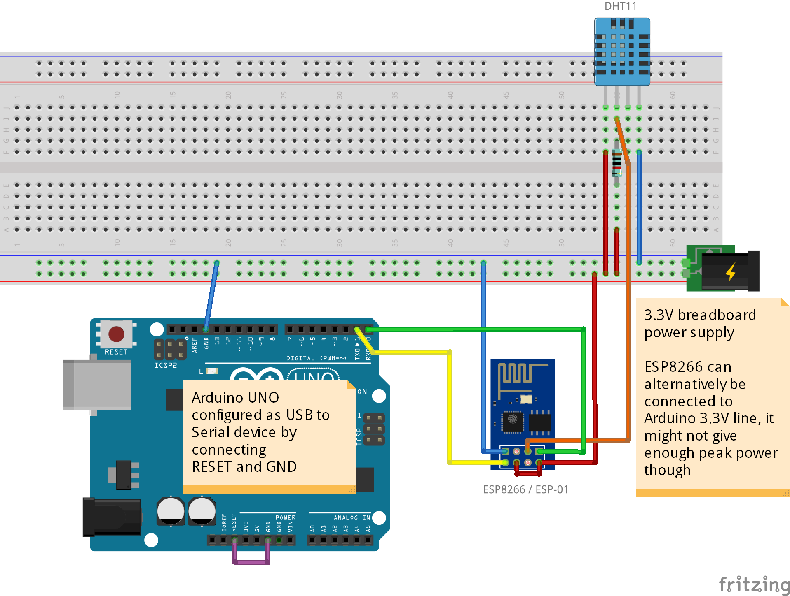

# ESP8266 with DHT11 

## Setup

You need an ESP8266 with [nodemcu firmware](https://github.com/nodemcu/nodemcu-firmware). For programming your ESP8266 you need either an Arduino or other USB-to-serial adapter. 

I'm using [ESPlorer](http://esp8266.ru/esplorer/) to program the LUA scripts onto the ESP8266 memory.

## Connection Diagram

Connect the ESP8266 with the DHT11. 

Connect the Arduino to the ESP8266 for programming the device. The Arduino can be removed after programming the device and if you are using an external power supply or battery.

ESP8266 PIN | device
----------- | -------
GND         | GND
GPIO2       | -
GPIO0       | DHT11 data (2nd from left) & 3.3V VCC w/ 10kΩ resistor
URXD        | Arduino 0 (RX), for programming
UTXD        | Arduino 1 (TX), for programming
CH_PD       | 3.3V VCC
RST         | -
VCC         | 3.3V VCC

See also at [Adafruit: "Connecting to a DHTxx Sensor"](https://learn.adafruit.com/dht/connecting-to-a-dhtxx-sensor)

Fritzing Parts: [DHT11](https://github.com/adafruit/Fritzing-Library/blob/master/parts/DHT11%20Humitidy%20and%20Temperature%20Sensor.fzpz), [ESP8266](https://github.com/ydonnelly/ESP8266_fritzing)

## The script

The script is an adaption from [ok1cdj's DHT11 script](https://github.com/ok1cdj/ESP8266-LUA/blob/master/Thermometer-DHT11-Thingspeak/dht11.lua) for Thingspeak.

Configure your wifi SSID and password in `init.lua`, configure your [OpenSenseMap](http://opensensemap.org/) box id and temperature & humidity sensor ids in `dht11.lua`.

Save both `init.lua` & `dht11.lua` on your device, then restart it.